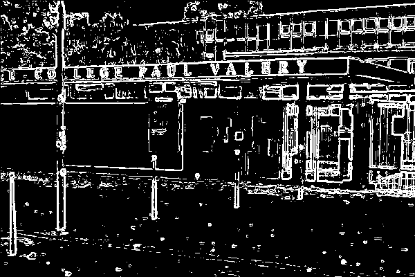

TP25 : tableaux bidimensionnels en `C` et détection de contours
==

Rappel: compilez avec le plus d'options possibles, par exemple `-Wall
-Wno-unused -pedantic -Werror -Wextra`.


En adaptant `dim1a.c`, affichez les adresses de `tt0`, `tt1`, `tt2`, puis
les adresses des trois sous-tableaux de chacun.

Exécutez votre programme sur [C tutor](https://pythontutor.com/c.html#mode=edit) pour comprendre comment sont réparties les données.

Affichez les adresses des deux cases de chacun des trois sous-tableaux
de `tt0`, puis de ceux de `tt1`, puis de ceux de `tt2`.

Regardez de plus près les adresses de `t[0][1]` et `t[1][0]` (pour `t`
prenant les valeurs `tt0`, `tt1`, `tt2`et `tt3`). Que remarquez-vous ? Que
pouvez-vous conclure sur la façon dont les tableaux `tt2` et `tt3`
sont rangés en mémoire ?

Regardons maintenant ce qui se passe avec les fonctions.

On considère les quatre fonctions suivantes disponibles dans le fichier
[dim2b.c](dim2b.c):

```C
void fpp(int **t){
  printf("fpp\n");
}

void fpt(int *t[]){
  printf("fpt\n");
}

void ftt1(int t[3][2]){
  printf("ftt1\n");
}

void ftt2(int t[][2]){
  printf("ftt2\n");
}
```

Essayez d'invoquer ces fonctions avec `tt0`, `tt1`, `tt2` et `tt3`
comme argument. Faites le bilan de ce qui est possible et de ce qui ne
l'est pas.


Bien sûr, il faut garder en tête qu'une fonction ne ne peut pas
renvoyer une adresse dans sa pile d'appel, puisqu' à la sortie de
l'appel cet adresse n'a plus de sens. En revanche, rien n'interdit de
transmettre à un appel de fonction une adresse locale, l'appel ayant
alors la possibilité de modifier le contenu à cette adresse.

## Contour d'image

Dans ce qui suit, je vais utiliser des variables déclarées `const`
comme longueurs de tableaux statiques au lieu de macro définies avec
`#define`. En fait ce sont du coup des VLA - *variable length array*,
qui sont donc explicitement hors programme. Mais un
des concours a utilisé ça dans un énoncé. Au moins vous l'aurez vu une fois.

### Par dérivée

Le but ici est de partir d'une image au format pgm ascii de taille
400x600 et d'en extraire le contour (sous forme d'une image de
même dimension et au même format, ne contenant que du noir et du
blanc).

Par exemple l'image


permet d'obtenir le contour



Le principe pour trouver le contour d'une image, est de repérer les
points dont la couleur varie particulièrement par rapport aux couleurs
des voisins.

Pour cela, on regarde la variation par rapport au voisin du dessous
et au voisin de droite (en fait par rapport au voisin obtenu en
décrémentant l'abscisse et au voisin obtenu en décrémentant
l'ordonnée, peu importe l'orientation de l'image).

Le but est d'écrire les fonctions `derive` et `seuil` déclarées dans
le fichier [contours.h](contours.h) de façon à pouvoir exécuter la
fonction principale contenue dans [main.c](main.c).

Pour `derive`: la valeur obtenue pour le pixel
 &space;) est
 -I(x-1,y)\bigr)^2&plus;\bigl(I(x,y)-I(x,y-1)\bigr)^2}&space;)
 (quand cela a un sens).

La fonction `seuil` permet ensuite de modifier l'image transmise en
mettant 0 pour les valeurs inférieures au seuil et 1 pour les autres
(dans l'exemple j'ai pris un seuil de 4000).


### Par filtres plus perfectionnés

Il existe des opérateurs permettant de détecter les contours de façon
un peu plus fine, en variant les directions considérées. Ils s'écrivent tous sous forme de matrice 3x3
noté   et
s'appliquent sous forme de produit de convolution:

\times&space;I\bigl(x-u,y-v\bigr)&space;)

(Il faut bien entendu faire attention aux bords.)

Écrire une fonction qui prend pour paramètre une image source sous la
forme d'un tableau d'entiers de taille `haut`x`larg`, un filtre de
taille 3x3, et une image destination sous la
forme d'un tableau d'entiers de taille `haut`x`larg` et remplit
l'image destination avec le produit de convolution.

Vous pouvez faire des tentatives avec les filtres suivants:

* opérateurs de Prewitt:


* opérateurs de Sobel:


* opérateurs de Kirch


* opérateurs de Robinson


* laplacien


