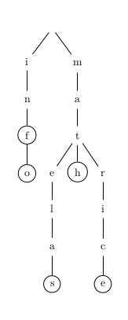

TP17 + DM : arbres lexicographiques
===

[Ce TP est à rendre sous forme de DM: le code sur
[cahier-de-prepa](https://cahier-de-prepa.fr/mp2i-pv/), les questions
de complexité sur une copie. La date de rendu est fixée au 10
février 2023.]

Un _arbre lexicographique_ (_trie_ en anglais) est un arbre qui sert à
représenter un ensemble fini de mots (un mot étant une suite de finie
de lettres).

Pour simplifier, on suppose dans la suite que les seules lettres
utilisées sont les lettres minuscules non accentuées.

L'ensemble de mots { "inf", "info", "matelas", "math", "matrice"} est représenté par l'arbre

On peut implémenter un tel arbre en utilisant un tableau de taille 26
pour représenter les fils d'un nœud, ou avec une liste chaînée de
longueur au plus 26 pour cela (dans l'idéal les fils étant dans
l'ordre alphabétique). Dans ce TP, on fait le choix
d'implémenter l'arbre en représentation fils gauche / frère droit.

Ce qui donne pour l'exemple précédent:

Tout le TP est à faire en `C` et en `ocaml`.

Comme on n'a pas vraiment encore fait les chaînes de caractères, ni en
`C`, ni en `ocaml`, on va considérer à la place:
* des tableaux de caractères en `C`, avec le caractère `\0` comme
sentinelle (bon et pour ne rien vous cacher, c'est ça une chaîne de
caractères en `C`),
* des listes de caractères en `ocaml`.

Pour chaque exercice qui est de la programmation:
* Vérifiez que votre code compile.
* S'il y a quelque chose à exécuter, testez-le sur un exemple (au
  minimum sur l'exemple de l'exercice 2).

## Exercice 1 : structure de données
Proposer une implémenation de la structure de données qui respecte les
contraintes ci-dessus (notamment concernant la représentation par
arbre fils gauche / frère droit).

## Exercice 2 : essayer sur un exemple
Construire à la main l'arbre lexicographique correspondant au lexique
donné en exemple.

## Exercice 3 : liste de mots
Écrire une fonction qui prend en argument un arbre lexicographique et
affiche la liste des mots qu'il contient.

Quelle sont les complexités de vos fonctions (`C` et `ocaml`) par
rapport à la taille des données?

## Exercice 4 : insérer un mot dans un lexique
Écrire une fonction permettant d'ajouter un mot
(format d'un mot décrit avant les exercices) dans un arbre
lexicographique.

Quelle sont les complexités de vos fonctions (`C` et `ocaml`) par
rapport à la taille des données?

## Exercice  : supprimer un mot du lexique
Écrire une fonction permettant de supprimer un mot d'un arbre lexicographique.

Quelle sont les complexités de vos fonctions (`C` et `ocaml`) par
rapport à la taille des données?

